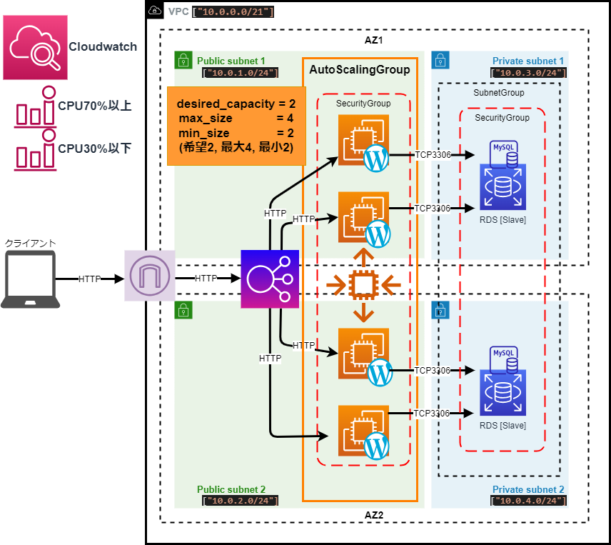

# Terraform勉強-第22回：VPC, SecurityGroup, EC2, RDSの作成とWordPressセットアップ

githubリポジトリ："https://github.com/shu130/terraform-study22"

## テーマ：前回(第21回)の構成を変更
- EC2インスタンスをAuto Scalingグループに変更
- CPU使用率をトリガーにしてScalingグループのインスタンス数の増減を自動的に行う
- CloudWatchアラームを追加し、指定した条件でインスタンスをスケールイン・スケールアウトさせる  
- `ec2.tf`は削除し、`autoscaling.tf`、`clouodwatch.tf`を作成

## 構成図作成



## ディレクトリ

```text
.
├── provider.tf
├── vpc.tf
├── autoscaling.tf
├── cloudwatch.tf
├── elb.tf
├── rds.tf
├── securitygroup.tf
├── scripts   
│   └── wordpress_user_data.sh
├── variables.tf
├── terraform.tfvars
└── outputs.tf
```

## Auto Scarling作成

`./autoscaling.tf` で使うリソースブロックと設定項目を整理

| リソース名 / 説明        | 主な設定項目      |
|-------------------------|------------------------------------------------------------------------------------------------------------------------------------------------------------------------|
| **`aws_launch_template`** <br> - EC2インスタンスの設定を定義| - `name_prefix`: テンプレート名のプレフィックス <br> - `image_id`: AMIのID（OSやソフトウェアを定義）<br> - `instance_type`: インスタンスタイプ（t2.microなど）<br> - `key_name`: SSHキーの名前 <br> - `user_data`: 起動時のスクリプト（WordPressインストールなど）<br> - `network_interfaces`: ネットワーク設定（公開IPの割り当てやセキュリティグループ）<br> - `tag_specifications`: タグ設定 |
| **`aws_autoscaling_group`** <br> - EC2のスケーリングを管理 | - `desired_capacity`: 起動するEC2のデフォルトの数 <br> - `max_size`: 最大インスタンス数 <br> - `min_size`: 最小インスタンス数 <br> - `launch_template`: 参照する起動テンプレート <br> - `vpc_zone_identifier`: VPC内のサブネットID <br> - `health_check_type`: ヘルスチェックタイプ <br> - `target_group_arns`: 対応するターゲットグループのARN  |
| **`aws_autoscaling_policy`**  <br> - オートスケーリングポリシー  | - `for_each`: スケールインとスケールアウトのポリシーを定義するマップ <br> - `name`: ポリシーの名前（スケールイン・アウトを区別）<br> - `scaling_adjustment`: 増減するインスタンス数（正で増加、負で減少）<br> - `adjustment_type`: `ChangeInCapacity`（インスタンス数の直接増減）<br> - `autoscaling_group_name`: ASGの名前 | 

### コード作成

```hcl:autoscaling.tf
# ./autoscaling.tf

# EC2のローンチテンプレート
resource "aws_launch_template" "ec2_launch_template" {
  name_prefix   = "${var.ec2_instance_name}-lt-"
  image_id      = var.ec2_ami
  instance_type = var.ec2_instance_type
  key_name      = var.ec2_key_pair
  user_data     = base64encode(templatefile("${path.module}/scripts/wordpress_user_data.sh", {
    rds_db_name  = var.rds_db_name,
    rds_username = var.rds_username,
    rds_password = var.rds_password,
    rds_endpoint = aws_db_instance.rds_instance.endpoint
  }))

  network_interfaces {
    associate_public_ip_address = true
    security_groups = [aws_security_group.asg_sg.id]
  }

  tag_specifications {
    resource_type = "instance"
    tags = {
      Name = "${var.ec2_instance_name}"
    }
  }
}

# オートスケーリンググループ
resource "aws_autoscaling_group" "ec2_asg" {
  desired_capacity = 2
  max_size         = 4
  min_size         = 2
  launch_template {
    id      = aws_launch_template.ec2_launch_template.id
    version = "$Latest"
  }
  vpc_zone_identifier       = [aws_subnet.public_subnets[0].id, aws_subnet.public_subnets[1].id]
  health_check_type         = "EC2"
  health_check_grace_period = 300
  target_group_arns         = [aws_lb_target_group.my_target_group.arn]

  tag {
    key   = "Name"
    value = "${var.ec2_instance_name}"
    propagate_at_launch = true        #=> (1)
  }
}

# オートスケーリングポリシー
resource "aws_autoscaling_policy" "scale_policy" {
  for_each = {
    scale_out = {
      name = "${var.ec2_instance_name}-scale-out-policy"
      scaling_adjustment = 1
    }
    scale_in = {
      name = "${var.ec2_instance_name}-scale-in-policy"
      scaling_adjustment = -1
    }
  }

  name                   = each.value.name
  scaling_adjustment     = each.value.scaling_adjustment  #=>(2)
  adjustment_type        = "ChangeInCapacity"             #=>(2)
  autoscaling_group_name = aws_autoscaling_group.ec2_asg.name
}

```
### コード中の(1) `propagate_at_launch` について：
- **`propagate_at_launch = true`** を指定すると、  
  ASGに関連付けたタグが、新しく起動されるインスタンスに対しても自動的に適用される。  
  ASGで管理されるインスタンスに一貫性を持たせるために、  
  例えば監視ツールやログ収集などでインスタンスに特定のタグを付けておきたい場合に便利。
- `propagate_at_launch = false` に設定した場合、  
  そのタグはASG自体にのみ適用され、起動したインスタンスには引き継がれない。

### コード中の(2)`scaling_adjustment`と`adjustment_type` と について：

- `scaling_adjustment` は、`adjustment_type` に応じて解釈が変わる

- #### 1. **ChangeInCapacity**
   - **動作**: 指定した数だけインスタンスを増減  
     `scaling_adjustment` の値が **正の数** なら増加、**負の数** なら減少
   - **用途**: 特定の数だけインスタンスを増減させたい場合
   - **例**:
     ```hcl
     resource "aws_autoscaling_policy" "scale_out" {
       name                   = "scale-out-policy"
       scaling_adjustment     = 2  # インスタンスを2つ増加
       adjustment_type        = "ChangeInCapacity"
       autoscaling_group_name = aws_autoscaling_group.my_asg.name
     }
     ```
   - **解釈**: 上記の設定では、現在のインスタンス数がたとえば**2**であれば、スケールアウトで**4**になる。

- #### 2. **ExactCapacity**
   - **動作**: スケール操作によってインスタンス数を `scaling_adjustment` の値と **完全に同じ** 数にする
   - **用途**: インスタンス数を特定の数にしてコストを固定したい場合
   - **例**:
     ```hcl
     resource "aws_autoscaling_policy" "set_exact_capacity" {
       name                   = "set-exact-capacity-policy"
       scaling_adjustment     = 5  # インスタンス数を5に設定
       adjustment_type        = "ExactCapacity"
       autoscaling_group_name = aws_autoscaling_group.my_asg.name
     }
     ```
    >この設定は、スケールイン・アウトの操作が行われるたびにインスタンス数が必ず **5にリセット** され>る。  
    > 現在のインスタンス数にかかわらず、5に設定される。

##### 3. **PercentChangeInCapacity**
   - **動作**: 現在のインスタンス数を基準として、指定したパーセンテージ分のインスタンスを増減させる
   - **用途**: 短期間で負荷が急激に変動する状況で、常に現在のインスタンス数に比例してスケールを行いたい場合  
   - **例**:
     ```hcl
     resource "aws_autoscaling_policy" "scale_by_percentage" {
       name                   = "scale-by-percentage-policy"
       scaling_adjustment     = 20  # インスタンス数を20%増加
       adjustment_type        = "PercentChangeInCapacity"
       autoscaling_group_name = aws_autoscaling_group.my_asg.name
     }
     ```
   - **解釈**: 現在のインスタンス数が **10** の場合、20% 増加は **12** になります。常に現在のインスタンス数に対して適用されるので、増減が自動的に調整される動的な環境で便利です。

---

## CloudWatchアラーム設定

 `./cloudwatch.tf` で使うリソースブロックと設定項目を整理

| リソース名 / 説明                                      | 主な設定項目                                                                                                                                                                                                                 |
|-------------------------------------------------------|------------------------------------------------------------------------------------------------------------------------------------------------------------------------------------------------------------------------------|
| **`aws_cloudwatch_metric_alarm` `** <br> - CPU使用率に基づいて、スケールインまたはスケールアウトのアラームを作成 | - `for_each`: スケールアウトとスケールインのアラーム設定を作成するマップ <br> - `alarm_name`: アラームの名前（スケールイン・アウトで区別）<br> - `comparison_operator`: 閾値の比較演算子（スケールアウト: `GreaterThanOrEqualToThreshold`、スケールイン: `LessThanOrEqualToThreshold`）<br> - `evaluation_periods`: アラームがトリガーされるまでの評価期間 <br> - `period`: メトリクスの評価間隔（秒単位） <br> - `metric_name`: メトリクス名（CPU使用率のモニタリング） <br> - `namespace`: メトリクスの名前空間（AWS/EC2） <br> - `statistic`: 統計タイプ（Average、Sumなど） <br> - `threshold`: 閾値（スケールアウトは70%、スケールインは30%）<br> - `alarm_actions`: トリガーされた際に実行するアクション（スケールアウト/インのポリシーのARN） <br> - `dimensions`: アラームが関連するリソース（Auto Scaling Group名）|


### コード作成

```hcl:./cloudwatch.tf
# ./cloudwatch.tf

# CloudWatchアラームでCPU使用率に基づいてスケールインとスケールアウト
resource "aws_cloudwatch_metric_alarm" "cpu_scale_alarm" {
  for_each = {
    scale_out = {
      alarm_name          = "${var.ec2_instance_name}-scale-out"
      comparison_operator = "GreaterThanOrEqualToThreshold"
      threshold           = 70
      alarm_actions       = [aws_autoscaling_policy.scale_out_policy.arn]
    }
    scale_in = {
      alarm_name          = "${var.ec2_instance_name}-scale-in"
      comparison_operator = "LessThanOrEqualToThreshold"
      threshold           = 30
      alarm_actions       = [aws_autoscaling_policy.scale_in_policy.arn]
    }
  }

  alarm_name          = each.value.alarm_name
  comparison_operator = each.value.comparison_operator
  evaluation_periods  = 2                              #=>(1)
  metric_name         = "CPUUtilization"
  namespace           = "AWS/EC2"
  period              = 120
  statistic           = "Average"
  threshold           = each.value.threshold
  alarm_actions       = each.value.alarm_actions
  dimensions = {
    AutoScalingGroupName = aws_autoscaling_group.ec2_asg.name
  }
}

```

### コード中の(1) `aluation_periods` について：

`evaluation_periods` の単位は「期間の回数」。  
**指定した回数分の期間にわたって評価基準を満たす場合にアラームがトリガーされる。**

例えば、次のように設定した場合:
- `evaluation_periods = 2` (回数)
- `period = 120` (秒)

**連続する2回の120秒間**（合計4分間）の間に、設定した閾値（例：CPU使用率70%）を超えるかどうかが評価される。  
2回とも評価基準を満たした場合にアラームがトリガーされる。

---
今回はここまでにしたいと思います。